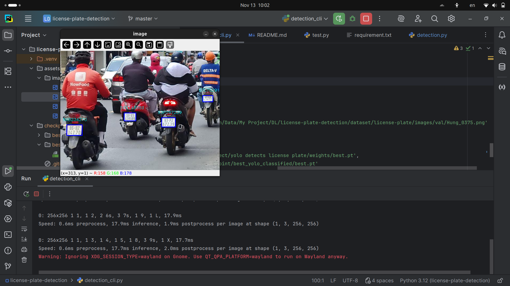
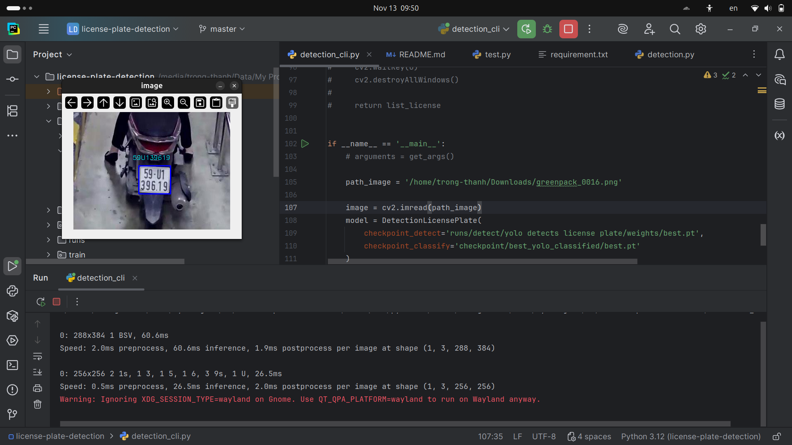
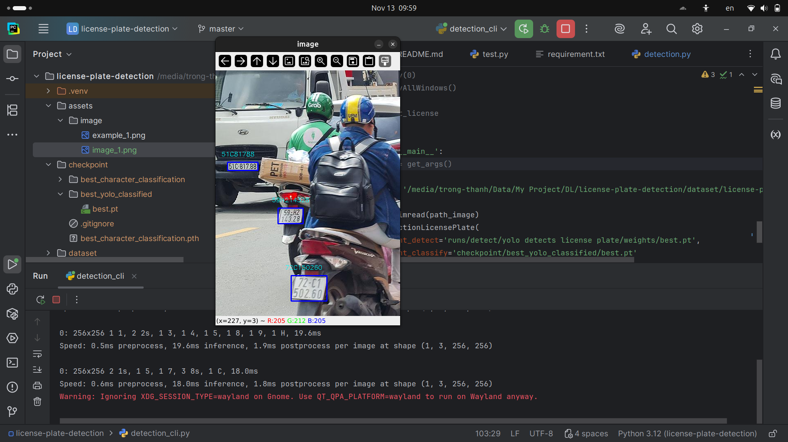
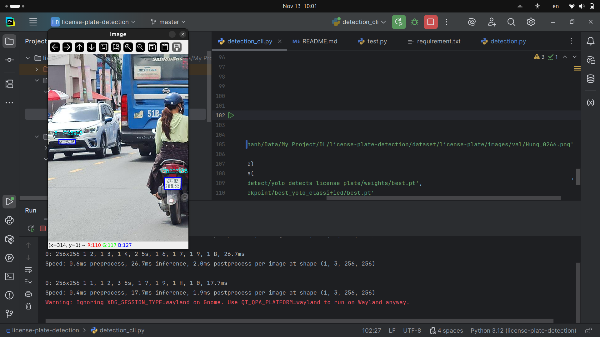

# Detection license plate (version Vietnam)

## Problem

In Vietnam, license plates have 8 or 9 characters, one row or two rows, and their backgrounds have many colors such as
yellow, blue, white,etc..
The problem here is how to detect this, detect character on this, how to arrange these characters in
correct position after detect characters and finally is how to recognize all background color of license plate.

## My solution

The technologies used in this project include Yolo architecture to detect license plates and characters within them,
convolutional
neuron network to classify each character. I used K-means algorithm or other algorithm to split rows if there are more
than
one row and then arrange characters in the correct position.

Frameworks used are:
`PyTorch`,
`OpenCV`,
`Scikit Learn`,
`YOLO v11`

## Benefit

Benefit of this program is:

- Program can detect multiple license plates with detection accuracy of up to more than 80% (but characters
  classification in it is so bad).
- Realtime, it can integrate into camera.
- Easy to use.

## Pipeline

```text
Input -> Yolo detect license plate -> Yolo classified letter -> Format  (K-Means/Heuristic Format) -> Result
```

## Install

#### Download repo

```commandline
git clone https://github.com/ntrThanh/detection-license-plate.git
cd detection-license-plate
```

#### Create python environment

```commandline
python -m venv .venv
source .venv/bin/activate 
```

#### Install required packages

```commandline
pip install -r requirement.txt
```

## User manual

Run program, you can run by `CLI` or use function `detect_use_image(image_path)` in `detection.py` module.

#### Use command line interface


```commandline
python detection_cli.py arguments
```

**Arguments:**

- `-i`, `--image`       : Detect objects in a single image file.
- `-c`, `--camera`      : Perform real-time detection using a camera.
- `-v`, `--video`       : Detect objects in a video file.
- `-cdt`, `--checkpoint-detect`: Path to the YOLO detection checkpoint.
- `cclf`, `--checkpoint-classify`: Path to the YOLO classification checkpoint.

## Example

These are examples:










## Project Status

All previously existing issues in the project have been resolved.
The dataset has been improved, preprocessing has been corrected, and the detection–classification pipeline has been fully refined.
The model now performs robustly on various types of license plates and diverse backgrounds.

## Improvements

- Reworked and cleaned the entire dataset for better training quality.

- Fixed all preprocessing steps including plane transformation, resizing, and data setup.

- Retrained the detection and classification models to eliminate overfitting.

- Model now supports multiple license plate styles, backgrounds, and lighting conditions.

- Optimized the codebase to be cleaner, more stable, and easier to use or extend.

## Future Plans

- Continue collecting and labeling more high-quality data to further improve accuracy.

- Add more advanced features such as tracking, OCR enhancement, and multi-camera support.

- Publish the project as a standalone module, API service, or camera-integrated security system.

- Expand compatibility with web platforms, mobile apps, and IoT devices.

- If you have any ideas or contributions, feel free to contact me at: nguyentrongthanh672@gmail.com

## Reference

- https://docs.ultralytics.com/vi/
- https://pytorch.org/
- https://scikit-learn.org/stable/user_guide.html
- https://scikit-learn.org/stable/modules/generated/sklearn.cluster.KMeans.html
- https://www.kaggle.com/datasets/fareselmenshawii/license-plate-dataset
- https://www.kaggle.com/datasets/aladdinss/license-plate-digits-classification-dataset